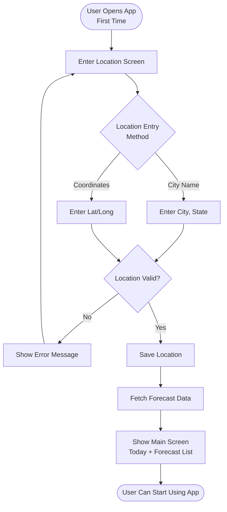
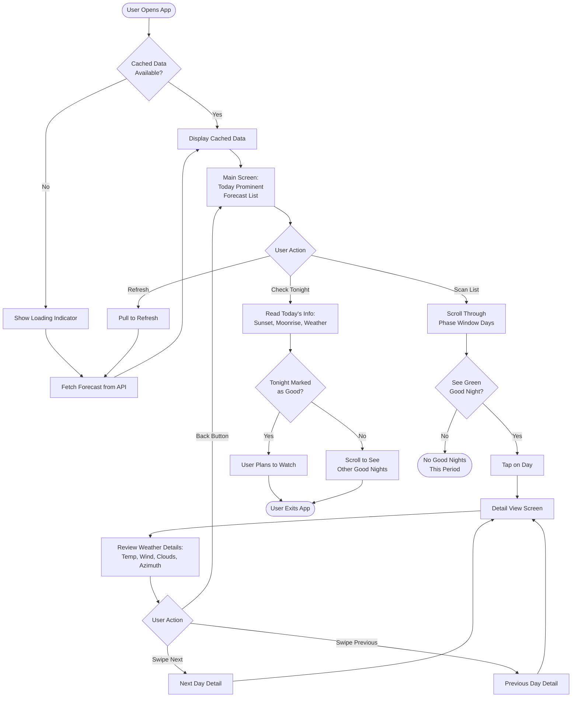
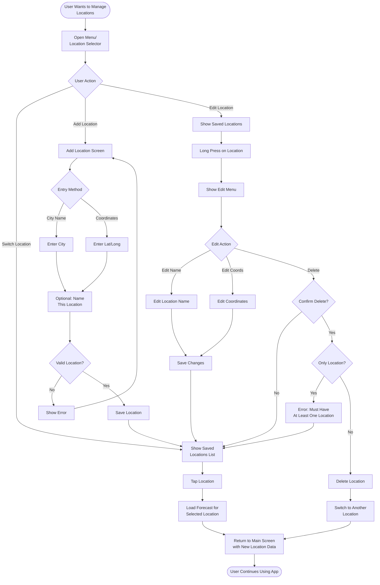
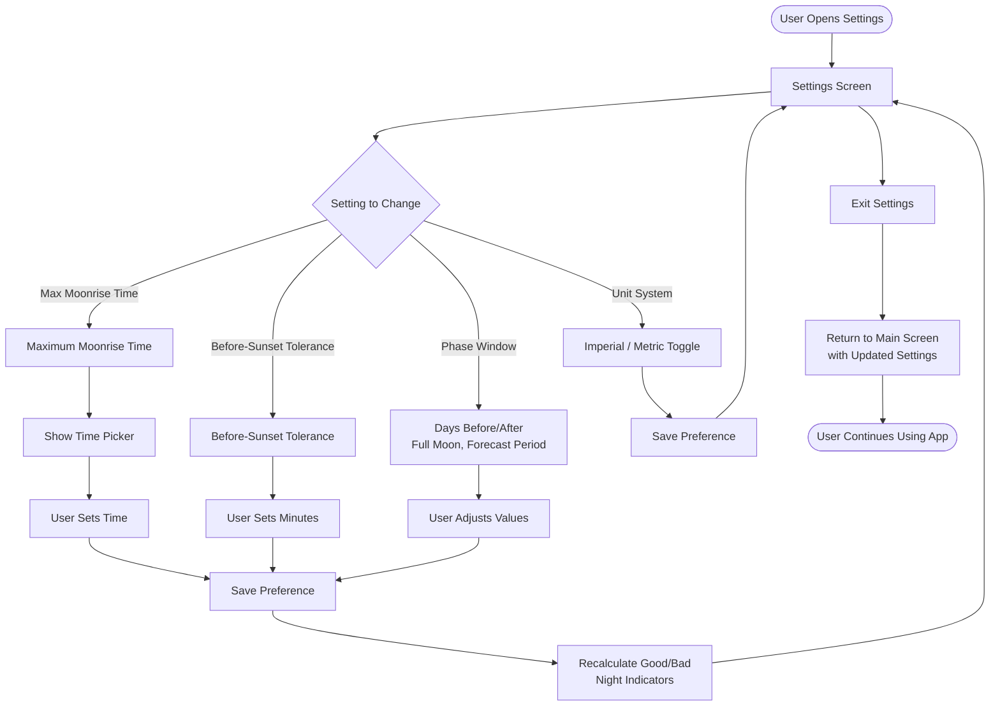
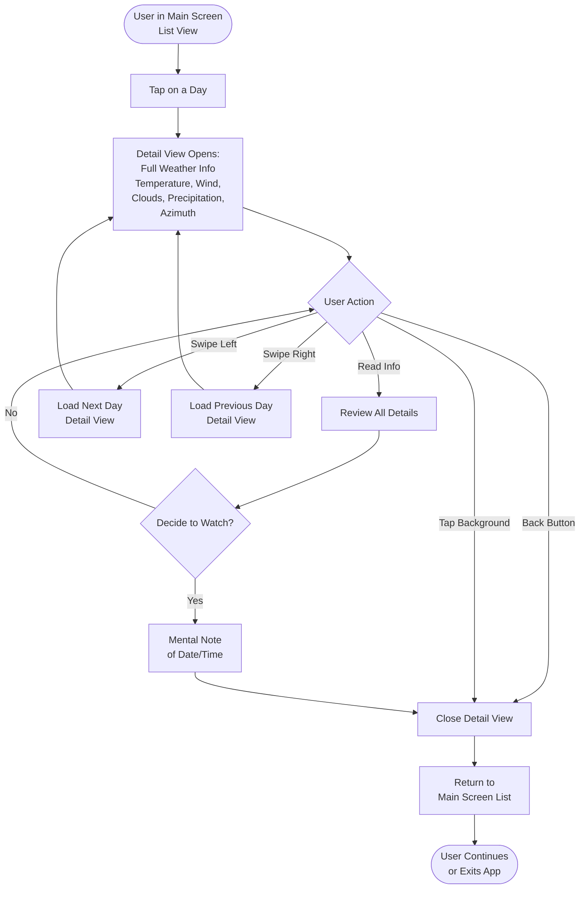
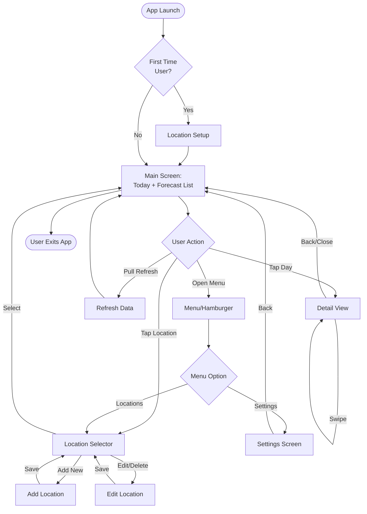
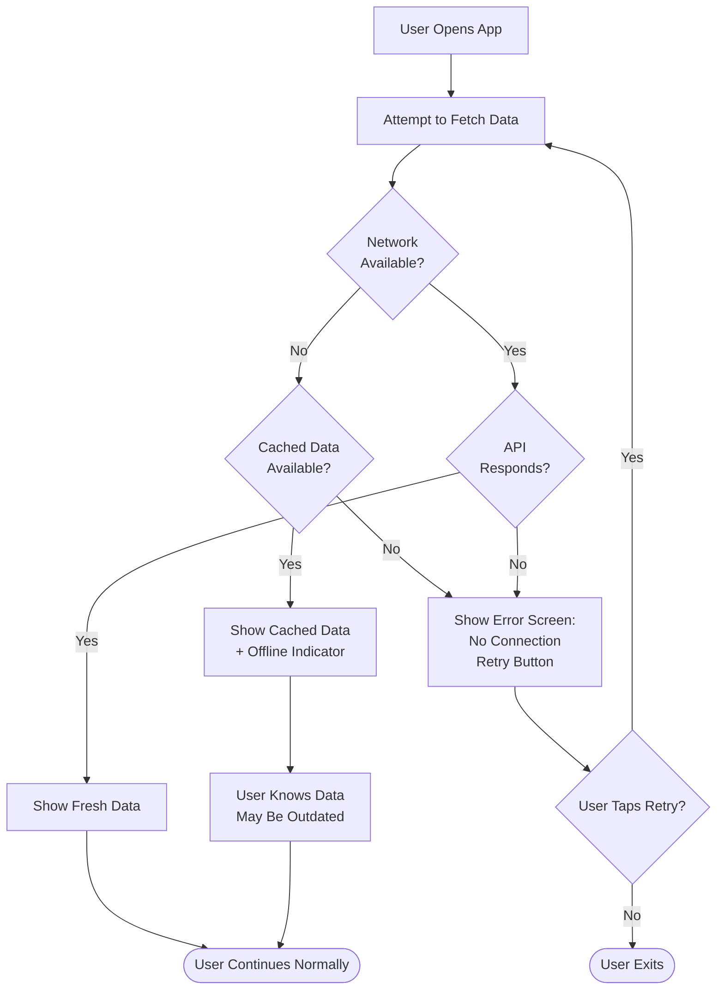
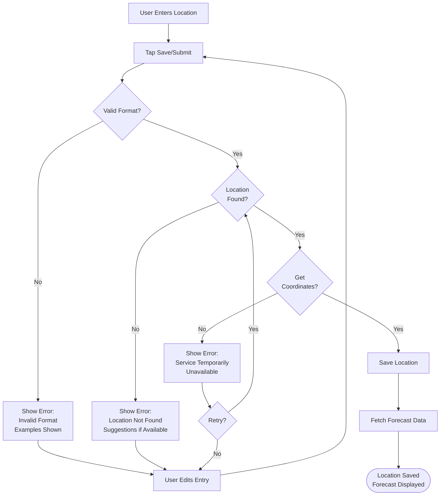

# User Flow Diagrams
# Moonrise Watching Assistant

**Date:** February 3, 2026
**Related Documents:** Moonrise_App_PRD.md, User_Stories.md

---

## Table of Contents

1. [Introduction](#introduction)
2. [Flow 1: First-Time User Setup](#flow-1-first-time-user-setup)
3. [Flow 2: Daily Check Workflow](#flow-2-daily-check-workflow)
4. [Flow 3: Location Management](#flow-3-location-management)
5. [Flow 4: Settings Configuration](#flow-4-settings-configuration)
6. [Flow 5: Detail View Navigation](#flow-5-detail-view-navigation)
7. [Complete App Navigation Map](#complete-app-navigation-map)

---

## Introduction

This document contains user flow diagrams showing how users interact with the Moonrise Watching Assistant. Each diagram is written in Mermaid format and will render as a flowchart on GitHub and in most markdown viewers.

---

## Flow 1: First-Time User Setup

This flow shows what happens when a user opens the app for the first time.



**Key Decision Points:**
- User chooses between city name or coordinates
- Location validation prevents invalid entries
- After successful setup, user immediately sees forecast

---

## Flow 2: Daily Check Workflow

This is the most common user flow - opening the app to check if tonight is good for moonrise watching.



**Key Behaviors:**
- App shows cached data immediately if available
- Today's info is prioritized for quick decision-making
- Good nights are visually highlighted for easy scanning
- Users can navigate between details without returning to list

---

## Flow 3: Location Management

This flow shows how users manage multiple viewing locations (Phase 2 feature, but included for completeness).



**Key Features:**
- Quick location switching from main screen
- Multiple ways to add locations
- Safety check prevents deleting last location
- Editing preserves user's place in the app

---

## Flow 4: Settings Configuration

This flow shows how users configure app preferences.



**Key Behaviors:**
- Changing moonrise time or tolerance immediately updates good/bad indicators
- Changing phase window parameters immediately updates the forecast list
- Unit system change applies to all temperature and wind speed values
- Settings are persistent across app sessions

---

## Flow 5: Detail View Navigation

This flow focuses specifically on how users interact with the detail view.



**Navigation Options:**
- Tap to open detail
- Swipe to navigate between days without closing
- Multiple ways to close (back button, tap outside)
- Information is read-only (no editing in detail view)

---

## Complete App Navigation Map

This diagram shows all major screens and how they connect.



**Screen Hierarchy:**
1. **Main Screen** - Central hub, where users spend most time
2. **Detail View** - Modal overlay, quick access and exit
3. **Location Selector** - Secondary screen, location management
4. **Settings** - Secondary screen, preferences

---

## Navigation Principles

### Design Decisions

1. **Main Screen is Home Base:** All flows return to main screen
2. **Minimal Depth:** No screen is more than 2 taps from main screen
3. **Fast Access:** Most common action (check tonight) requires zero navigation
4. **Non-Modal Settings:** Settings don't block main functionality
5. **Swipeable Details:** Users can browse days without constant back/forth

### Common User Paths

**Path 1: Quick Tonight Check**
```
Open App → Read Today Section → Exit
(0 taps beyond app launch)
```

**Path 2: Find Good Night This Week**
```
Open App → Scan List → Tap Good Day → Read Details → Back
(2 taps total)
```

**Path 3: Change Location**
```
Open App → Tap Location → Select Different Location → View New Forecast
(2 taps total)
```

**Path 4: Adjust Bedtime Preference**
```
Open App → Menu → Settings → Change Max Time → Back to Main
(3 taps total)
```

---

## Error Handling Flows

### Network Error During Data Fetch



### Invalid Location Entry



---

## Notes for Developers

### Rendering These Diagrams

These Mermaid diagrams will render automatically on:
- GitHub (in markdown files)
- GitLab
- Many markdown editors (VS Code with Mermaid extension, Obsidian, etc.)

To render locally:
```bash
# Install mermaid-cli
npm install -g @mermaid-js/mermaid-cli

# Convert to image
mmdc -i User_Flows.md -o flows.png
```

### Using in Development

- Reference these flows when implementing navigation
- Use as basis for creating automated UI tests
- Share with designers to ensure UI supports these flows
- Update diagrams when requirements change

